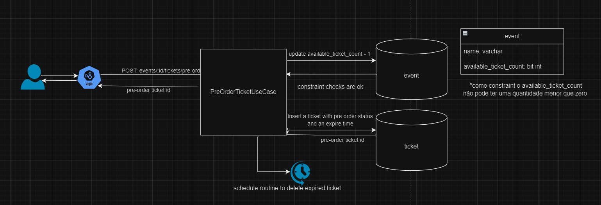
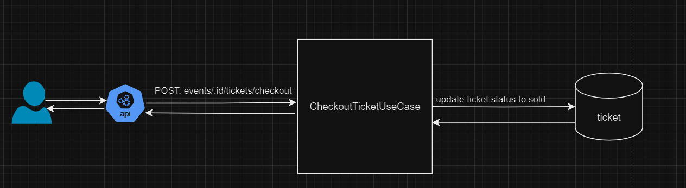
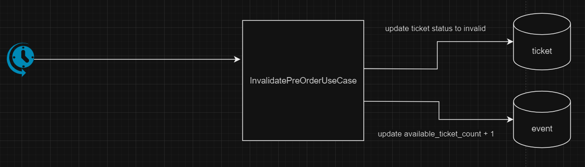

## Desafio:

Imagine que você é o(a) arquiteto(a) responsável pelo desenho de um sistema de logins para um site extremamente concorrido de ingressos de um mega show de Rock em Rio (got it?). Dado que o número de ingressos é limitado e muito inferior a quantidade de acessos no dia venda, você precisa garantir que o site só irá finalizar a venda para pessoas que realmente vão receber o ingresso, ou seja, você não pode deixar uma pessoa comprar um ingresso sem que haja mais disponíveis. Além disso, um cliente com internet mais lenta não ficaria feliz de não conseguir comprar seu ingresso pois uma pessoa com internet mais veloz passou sua frente.

## link para diagrama desenvolvido:

https://drive.google.com/file/d/16cSs-cau3u3wbLyxTs4eOUYEc59HWEp7/view?usp=sharing

## Acesso a página

Ao acessar a página será feito um pre-order do ingresso para o show. Esse ingresso será retirado da lista de ingressos disponíveis, de modo que ocorra a validação de constraints do banco para que o número de ingressos nunca seja negativo. Além disso, será criado um ingresso com status de pre-order e com um tempo para invalidação. Para a invalidação, deverá ser agendado um evento que atualize o status do ingresso invalidado.

## Checkout

Para o checkout, apenas atualizamos o status do ingresso para vendido, finalizando o fluxo de compra do ingresso

## Invalidação de tickets antigos

Quando um usuário ficar muito tempo sem interagir com a página, invalidaremos o ingresso que estava em pre-order. Também retornaremos esse ingresso para a contagem total de ingressos disponíveis pro evento

